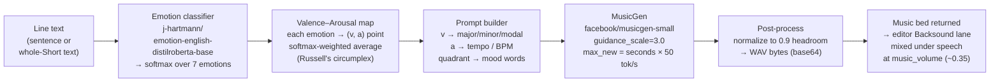

# Backsong Generation Workflow

How ViReel turns a line of transcript into a mood-matched background-music bed.
The flow reads the *sentiment* of the text, maps it to a point on the
valence–arousal plane, turns that into a MusicGen prompt, and generates a short
instrumental bed that gets mixed under the speech. Code lives in
`backend/server.py` (the `/backsound` endpoint and its helpers).

## Horizontal flowchart



### ASCII fallback (left → right)

```
 Line text ─▶ Emotion classifier ─▶ Valence/Arousal ─▶ Prompt builder ─▶ MusicGen ─▶ Post-process ─▶ Music bed
 (sentence)   distilroberta          (v, a) point        mode+tempo+mood    musicgen    normalize +      → Backsound lane,
              7-way softmax          Russell circumplex   text prompt        -small      to WAV/base64    mixed under speech
```

---

## Stage by stage

### 1. Input — the text to score
`BacksoundRequest.text` is a single line (or the whole Short's text). An optional
`duration_s` sets the bed length; if omitted it defaults to a spoken-length
estimate so the music roughly matches the clip.

### 2. Emotion classification
`_emotion_va()` runs **`j-hartmann/emotion-english-distilroberta-base`** over the
text (truncated to 128 tokens) and takes a softmax over its 7 emotion logits:
`anger, disgust, fear, joy, neutral, sadness, surprise`. It keeps both the full
probability distribution and the single dominant label.

### 3. Valence–Arousal mapping (Russell's circumplex)
Each emotion is pinned to a `(valence, arousal)` point in `[-1, 1]` via the
`_EMOTION_VA` table — e.g. `joy → (0.8, 0.6)`, `sadness → (-0.7, -0.4)`,
`anger → (-0.6, 0.8)`, `neutral → (0.0, 0.0)`. Instead of using only the top
emotion, the code takes the **softmax-weighted average** of those points, so a
line that's 60% joy / 40% surprise lands *between* the two — a smoother mood read.

| Emotion | Valence | Arousal |
|---|---|---|
| anger | −0.6 | 0.8 |
| disgust | −0.6 | 0.4 |
| fear | −0.7 | 0.8 |
| joy | 0.8 | 0.6 |
| neutral | 0.0 | 0.0 |
| sadness | −0.7 | −0.4 |
| surprise | 0.4 | 0.7 |

### 4. Prompt builder — (v, a) → MusicGen text prompt
`_va_to_music_prompt()` translates the point into musical language:

- **Mode** from valence: `≥ 0.15 → major key`, `≤ −0.15 → minor key`, else `modal`.
- **Tempo** from arousal: `≥ 0.5 → energetic ~120 BPM`, `≤ −0.1 → slow/sparse
  ~60 BPM ambient`, else `moderate ~90 BPM`.
- **Mood** from the valence × arousal quadrant (with a neutral dead-zone at the
  center): e.g. bright/uplifting, warm/gentle, dark/tense/dissonant, or
  somber/melancholic.

These combine into a prompt like:
`"<mood> instrumental background music, <mode>, <tempo>, cinematic underscore, no vocals"`.
The `no vocals` / `cinematic underscore` keywords keep the bed out of the way of
the speaker.

### 5. MusicGen generation
`_generate_music()` feeds the prompt to **`facebook/musicgen-small`** (overridable
via `TLDW_MUSICGEN`):

- `guidance_scale=3.0` — classifier-free guidance, so the audio follows the text
  prompt closely.
- `do_sample=True` — sampled (non-greedy) generation for musical variety.
- `max_new_tokens = duration_s × 50` — MusicGen emits ~**50 audio tokens/second**,
  so token count is derived from the requested bed length.

### 6. Post-process
The mono float waveform is peak-normalized to `0.9` headroom (avoids clipping
when mixed), encoded to WAV bytes at MusicGen's own sample rate, and returned
base64-encoded.

### 7. Use in the editor
The base64 WAV becomes a **music bed** on the editor's Backsound lane. It's
draggable and trimmable, and on export it's mixed under the speech at
`music_volume` (default `~0.35`) — either per-clip (`ClipSpan.music_b64`) or
placed freely on the merged timeline (`MusicPlacement`).

---

## Models & knobs

| Thing | Value | Where |
|---|---|---|
| Emotion model | `j-hartmann/emotion-english-distilroberta-base` | `EMOTION_NAME` |
| Music model | `facebook/musicgen-small` (env `TLDW_MUSICGEN`) | `MUSICGEN_NAME` |
| Token rate | ~50 audio tokens / second | `MUSICGEN_TOK_RATE` |
| Guidance | `guidance_scale = 3.0` | `_generate_music()` |
| Sampling | `do_sample = True` | `_generate_music()` |
| Headroom | peak-normalized to `0.9` | `_generate_music()` |
| Default mix volume | `~0.35` under speech | `ClipSpan.music_volume` |

> **Lazy loading:** the emotion + MusicGen weights only download/load on the
> first `/backsound` call (`_load_music()`), so `/highlight` startup stays fast.
