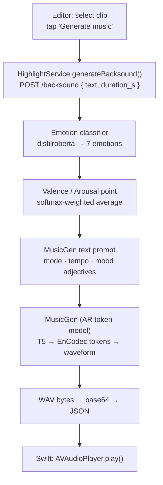
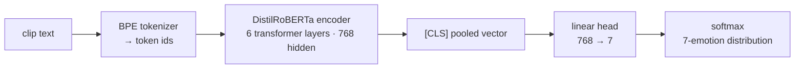

# Background Music (Backsound) Generation Workflow

How tldw turns a selected clip's text into an emotion-matched background music
bed. The pipeline is: **classify mood → map to a music prompt → generate with
MusicGen → package & play.**

## Pipeline at a glance



## Stage-by-stage

### 0. Trigger — editor to backend

| Where | What happens |
|---|---|
| `ContentView.swift` · `EditorView` | "Generate music" on the selected clip calls `generateBacksound(for:)`, which launches a `Task`. |
| `HighlightService.swift` · `generateBacksound(for:)` | POSTs `{ text, duration_s }` to `http://127.0.0.1:8000/backsound`. 600 s timeout, since the first call may download model weights. |
| `server.py` · `backsound()` | FastAPI handler; clamps duration to `[2, MUSIC_MAX_SECONDS]` and drives the pipeline. |

### 1. Sentiment → valence / arousal — `_emotion_va()`

- Model: **`j-hartmann/emotion-english-distilroberta-base`** (7 emotions: anger,
  disgust, fear, joy, neutral, sadness, surprise).
- Rather than taking the single top label, the softmax is used as a weighting to
  average each emotion's `(valence, arousal)` coordinate (`_EMOTION_VA`,
  Russell's circumplex):

  ```
  valence = Σ probs[i] · VA[label_i].valence
  arousal = Σ probs[i] · VA[label_i].arousal
  ```

- Output: `(valence, arousal, dominant_emotion, scores)`.
- Example: *"I have no mouth, and I must scream…"* → fear 0.93 → **V −0.69, A +0.78**.

### 2. Valence / arousal → music prompt — `_va_to_music_prompt()`

The continuous mood point is translated into musical language:

| Signal | Mapping |
|---|---|
| **Valence → mode** | ≥ 0.15 → major · ≤ −0.15 → minor · else modal |
| **Arousal → tempo/energy** | high → "driving, ~120 BPM" · low → "slow, sparse, ambient ~60 BPM" · mid → "~90 BPM" |
| **Quadrant → adjectives** | (−val, +aro) "dark, tense, dissonant"; (+val, +aro) "bright, uplifting"; (+val, −aro) "warm, gentle"; (−val, −aro) "somber, melancholic"; center → neutral dead-zone |

Result (the only thing MusicGen sees):

> *"dark, tense, suspenseful, dissonant instrumental background music, minor key,
> energetic and driving, around 120 BPM, cinematic underscore, no vocals."*

### 3. MusicGen generation — `_generate_music()`

Model: **`facebook/musicgen-small`** (override via `TLDW_MUSICGEN`). This is the
**autoregressive token** approach (not diffusion):

```python
inputs  = proc(text=[prompt], return_tensors="pt")
max_new = int(seconds * 50)        # MusicGen runs at ~50 audio tokens / second
audio   = gen.generate(**inputs, do_sample=True, guidance_scale=3.0,
                       max_new_tokens=max_new)
```

Inside `MusicgenForConditionalGeneration`:

1. **Text encode** — a frozen **T5 encoder** turns the prompt into token-level embeddings.
2. **Autoregressive decode** — a Transformer decoder predicts **EnCodec RVQ audio
   tokens** frame-by-frame, attending to the T5 embeddings via **cross-attention**.
   Each ~20 ms frame = 4 codebook tokens (residual vector quantization, coarse→fine),
   predicted with a **delay/interleaving pattern** to stay autoregressive without a
   4× longer sequence. `max_new_tokens = seconds × 50` sets clip length.
3. **Sampling + guidance** — `do_sample=True` samples tokens; `guidance_scale=3.0`
   is **classifier-free guidance**, pushing the output to match the prompt.
4. **Codec decode** — predicted tokens pass through the **EnCodec decoder** to
   reconstruct a **32 kHz mono waveform** (`audio[0,0]`, float in [−1, 1]).

> The frame-by-frame decode is why it's slow (~10–30 s on MPS for a few seconds of audio).

### 4. Package → transport → playback

```python
wav = audio[0,0].cpu().numpy()
wav = wav / (max|wav| + 1e-9) * 0.9     # normalize headroom
_to_wav_bytes(wav, sr)                   # float → 16-bit PCM → WAV container
```

- `_to_wav_bytes()` writes a real WAV (16-bit PCM; sample rate from
  `gen.config.audio_encoder.sampling_rate` = 32000).
- The handler base64-encodes it into JSON with `{ prompt, emotion, valence,
  arousal, scores }`.
- Swift decodes `audioB64` → `Data` → `AVAudioPlayer.play()` (shared `playAudio`).

## API contract

**`POST /backsound`**

```jsonc
// request
{ "text": "…clip line…", "duration_s": 6 }   // duration_s optional

// response
{
  "prompt":      "dark, tense … no vocals",
  "emotion":     "fear",
  "valence":     -0.69,
  "arousal":      0.78,
  "scores":      { "fear": 0.925, "anger": 0.057, … },
  "audio_b64":   "…base64 WAV…",
  "sample_rate": 32000,
  "duration_s":  6.0,
  "model":       "facebook/musicgen-small"
}
```

## Architectural overview

Two pretrained models sit at the heart of the pipeline. Neither is fine-tuned by
tldw — both are used off-the-shelf, the first as a feature extractor and the
second as a generator.

### Emotion classifier — `j-hartmann/emotion-english-distilroberta-base`

A **DistilRoBERTa encoder** fine-tuned for single-label emotion classification.



- **Backbone**: DistilRoBERTa — a distilled, 6-layer (~82 M param) version of
  RoBERTa-base. Encoder-only; bidirectional self-attention, no decoder.
- **Input**: a single text span, byte-pair-encoded, capped at 512 tokens.
- **Head**: the pooled representation feeds a linear classification head over the
  7 Ekman-style emotions (anger, disgust, fear, joy, neutral, sadness, surprise).
- **Output we use**: the full **softmax distribution**, not just the argmax — tldw
  treats the probabilities as weights to interpolate a continuous valence/arousal
  point (see Stage 1). This makes mixed/ambiguous lines degrade gracefully instead
  of snapping between discrete moods.
- **Cost profile**: a single forward pass, milliseconds on any device; negligible
  next to MusicGen.

### Music generator — `facebook/musicgen-small`

A **conditional autoregressive Transformer** over discrete audio tokens — *not* a
diffusion model. Three sub-models cooperate inside
`MusicgenForConditionalGeneration`.


- **Conditioning (T5)**: a frozen **T5 text encoder** maps the prompt to
  token-level embeddings. MusicGen only ever sees the text prompt — no audio
  reference, no melody conditioning in this configuration.
- **Generator (decoder)**: a Transformer **decoder** autoregressively predicts
  EnCodec residual-vector-quantization tokens, attending to the T5 embeddings via
  **cross-attention**. Each ~20 ms frame is 4 codebook tokens (coarse→fine),
  emitted on a **delay/interleaving pattern** so the four streams stay
  autoregressive without quadrupling sequence length. `max_new_tokens = seconds ×
  50` controls clip length (~50 tokens/sec).
- **Decoder of audio (EnCodec)**: predicted tokens pass through the **EnCodec
  decoder** to reconstruct a 32 kHz mono waveform.
- **Sampling**: `do_sample=True` with **classifier-free guidance** (`guidance_scale
  = 3.0`) trades diversity for prompt adherence.
- **Cost profile**: frame-by-frame decode dominates the request (~10–30 s on MPS
  for a few seconds of audio). `-small` is ~300 M params; `-medium`/`-large` raise
  quality and latency proportionally (override via `TLDW_MUSICGEN`).

### How they connect

The classifier is a **feature extractor** whose output is *not* fed directly to
MusicGen. Between them sits a deterministic, rule-based bridge
(`_va_to_music_prompt()`): emotion probabilities → valence/arousal → a natural-
language music prompt → MusicGen. Keeping the bridge symbolic (rather than, say,
learning a text-to-text mapping) makes the mood→music translation inspectable and
tunable without retraining either model.

## Models & configuration

| Role | Default | Override |
|---|---|---|
| Emotion classifier | `j-hartmann/emotion-english-distilroberta-base` | — |
| Music generator | `facebook/musicgen-small` | `TLDW_MUSICGEN` (e.g. `facebook/musicgen-medium`) |
| Compute device | inherits `DEVICE` (mps/cuda/cpu) | `TLDW_MUSIC_DEVICE` (set `cpu` if MPS misbehaves) |

- Both models are **lazily loaded** on the first `/backsound` call (`_load_music()`),
  so `/highlight` startup is unaffected.
- Weights are cached after first download (~2.3 GB for the small stack).

## Known gaps / next steps

- **No mixing/ducking** — the bed plays standalone; the app has no real clip audio
  yet (the timeline waveform is decorative).
- **Per-clip mood only** — reads the single selected clip; aggregating over a whole
  Short would avoid emotional whiplash across cuts.
- **No auto-reload** — `run.sh` runs uvicorn without `--reload`; editing `server.py`
  requires a restart.
