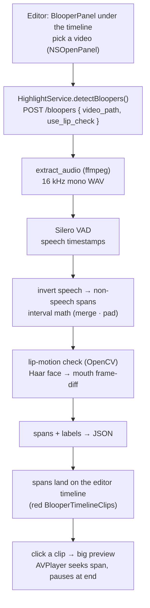

# Blooper (Non-Speech) Detection Workflow

How tldw finds the "bloopers" in a video — every span where nobody is talking
(silence, long pauses, dead air, dropped mics). The pipeline is: **extract audio
→ detect speech → invert to non-speech spans → confirm with a lip check →
preview in place.**

It lives as an inline panel docked **under the editor's timeline** (the "line
sequence"). For now the source video is chosen explicitly in that panel;
eventually it should default to the source of the selected clip on the timeline.

Unlike the standalone PoC (`poc-blooper-detector/blooper.py`, which also *cuts*
one `.mp4` per span), the app never ships clips around: it sends the backend a
**path** to the local video, gets back span timecodes, and previews each one by
seeking the **source** file in an `AVPlayer`. App and backend share the same
disk, so this stays cheap and sandbox-friendly.

## Pipeline at a glance



## Stage-by-stage

### 0. Trigger — picker to backend

| Where | What happens |
|---|---|
| `ContentView.swift` · `EditorView` | `BlooperPanel(onBloopers:)` is docked under the timeline; detected spans + their source video flow back up. Spans render as red dead-air clips in the same timeline sequence as the orange sentence clips (`BlooperTimelineClip`); clicking one plays it in the big top preview. Each clip has a merge checkbox — marking clips and tapping **Merge** opens `MergePreviewView`, which concatenates the marked blooper spans into one `AVMutableComposition` and plays it. |
| `BlooperView.swift` · `pickVideo()` | `NSOpenPanel` (movie types) returns a security-scoped URL; the app already holds `files.user-selected.read-only`. |
| `HighlightService.swift` · `detectBloopers()` | POSTs `{ video_path, use_lip_check }` to `http://127.0.0.1:8000/bloopers`. 600 s timeout — the first call downloads Silero VAD and decodes the whole video. |
| `server.py` · `bloopers()` | Validates the path, lazily imports the PoC module, runs `detect()`, returns span metadata. |

### 1. Audio extraction — `extract_audio()`

`ffmpeg` decodes the video's audio to a **16 kHz mono WAV** — exactly what Silero
VAD expects. (System prerequisite: `brew install ffmpeg`.)

### 2. Speech detection — `speech_spans()`

- Model: **Silero VAD**, fetched at runtime via `torch.hub` (no pip package).
- The WAV is read with `soundfile` (deliberately *not* torchaudio ≥ 2.9, whose
  I/O routes through the optional `torchcodec` package).
- Output: a list of `(start, end)` speech intervals in seconds.

### 3. Invert speech → non-speech spans — `nonspeech_spans()`

Pure interval math, no model:

| Step | Why |
|---|---|
| **merge** speech intervals closer than `merge_gap` (0.3 s) | tiny VAD flickers shouldn't shatter one pause into many |
| **complement** the merged speech over `[0, duration]` | the gaps *are* the candidate bloopers |
| **pad** each gap inward by `pad` (0.1 s) | don't clip the surrounding words |

There is **no minimum-duration threshold**: any non-speech span is a blooper
(`min_dur=0`). `merge_gap` and `pad` stay as VAD-hygiene only — smoothing flicker
and protecting word edges — so the practical floor is ~0.2 s, not a knob the user
sets.

### 4. Lip-motion check — `lip_motion_score()` (best effort)

For each span, OpenCV's bundled **Haar cascade** finds the largest face, crops the
mouth region (lower third of the face box), and measures the **mean absolute
frame-to-frame difference** of a normalised grayscale crop:

- **low** → mouth static → genuinely not speaking → `silent`
- **high** → mouth moving while audio is silent → `lips_moving` (mouthing, bad mic)
- **no face / no cv2** → `no_face`, audio-only verdict stands

> MediaPipe was dropped — its wheels are unreliable on macOS-arm64. The Haar
> cascade ships with `opencv-python` and works wherever `cv2` imports.

### 5. Preview — seek the source in the big editor preview

`EditorView` owns one `AVPlayer` (`bigPlayer`) loaded with the source video the
panel reported. Clicking a blooper clip on the timeline selects it and plays its
span in the big top preview:

```swift
item.seek(to: start, toleranceBefore: .zero, toleranceAfter: .zero) { _ in bigPlayer.play() }
bigPlayer.addBoundaryTimeObserver(forTimes: [NSValue(time: end)], queue: .main) { bigPlayer.pause() }
```

Frame-accurate seek to the span's start, then a boundary-time observer pauses the
moment playback crosses the end. The same preview shows sentence clips as text
(no real footage yet) and blooper clips as video — a single selection drives both.
No clip files, no base64 — just scrubbing the original.

## API contract

**`POST /bloopers`**

```jsonc
// request
{ "video_path": "/Users/…/clip.mov", "use_lip_check": true }

// response
{
  "source":     "clip.mov",
  "duration_s": 131.485,
  "count":      21,
  "params":     { "lip_check": true },
  "bloopers": [
    { "index": 0, "start": 0.1, "end": 1.022, "duration": 0.922,
      "lip_motion": null, "label": "no_face" },
    { "index": 1, "start": 8.866, "end": 11.102, "duration": 2.236,
      "lip_motion": 0.0223, "label": "lips_moving" }
    // …
  ]
}
```

Errors come back as FastAPI `{ "detail": … }`: **400** if the path isn't a file
on disk, **500** if ffmpeg / VAD / decoding fails (the reason is included).

## Models & configuration

| Role | Default | Notes |
|---|---|---|
| Voice-activity detection | **Silero VAD** | fetched via `torch.hub`, cached after first call |
| Face / mouth detection | **OpenCV Haar cascade** | bundled with `opencv-python` |
| Audio decode | **ffmpeg** | system prerequisite (`brew install ffmpeg`) |
| Compute device | CPU | VAD is tiny; the cost is decoding the video, not inference |

- The detector module is **lazily imported** on the first `/bloopers` call
  (`_load_blooper()`), so `/highlight` startup is unaffected — its top level only
  needs numpy; torch / soundfile / cv2 load on first `detect()`.

## Known gaps / next steps

- **Video is picked manually** — the panel should default to the source video of
  the selected clip on the timeline, instead of a separate `NSOpenPanel`.
- **Timeline clips are markers, not media** — blooper spans now sit in the
  timeline sequence (`BlooperTimelineClip`) and are removable, but they're
  positional markers; wiring `cut_clips()` (or in-place seeks) would let them
  render/export as real footage alongside the sentence clips.
- **Whole-video decode per scan** — toggling the lip check re-runs the whole VAD
  pass; caching speech timestamps per file would make a re-scan instant.
- **Single-face lip check** — only the largest face is tracked; multi-speaker
  panels can mislabel a silent host as `lips_moving` when a guest is mouthing.
