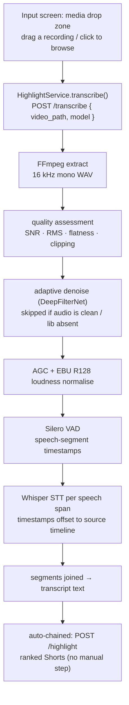

# Transcription (Audio Extraction) Workflow

How tldw turns a **raw recording into a transcript** the highlighter can rank.
The extracted audio **is** the app's input — there is no text field to paste
into. You point the app at a local video or audio file and it runs, end to end:
**extract audio → assess quality → adaptively denoise → level & normalise →
detect speech (VAD) → transcribe each speech span (Whisper) → summarise, embed &
score the lines → show the ranked Shorts.**

It **is** the input screen: a drop zone (drag a recording, or click to browse).
Dropping a file kicks off the whole pipeline in one shot — transcription flows
straight into ranking under a single loading state, so it's media in, Shorts out.

The heavy lifting is the `audio_preprocessor` package from the
`poc-audio-extraction/` PoC, wrapped by `transcribe_pipeline.py` so the backend
gets a single `transcribe(path) → { text, segments }` call. As with bloopers,
the app sends a **path** to the local file (app + backend share disk); no media
is shipped over the wire.

## Pipeline at a glance



## Stage-by-stage

### 0. Trigger — picker to backend

| Where | What happens |
|---|---|
| `ContentView.swift` · `mediaDropZone` / `pickAndTranscribe()` | The input screen is a drop zone; a dropped or browsed (`NSOpenPanel`) file returns a security-scoped URL. The app already holds `files.user-selected.read-only`. |
| `HighlightViewModel.swift` · `transcribeAndHighlight(at:)` | One loading state across both stages: transcribe, then (if any speech was found) immediately rank. `transcriptText` holds the result for the results-header disclosure. |
| `HighlightService.swift` · `transcribe()` | POSTs `{ video_path, model }` to `http://127.0.0.1:8000/transcribe`. 1800 s timeout — the first call downloads the Whisper weights and transcribes the whole file. |
| `server.py` · `transcribe()` | Validates the path, lazily imports `transcribe_pipeline`, runs it, returns transcript text + timestamped segments. |

### 1–6. Preprocessing — `AudioPreprocessor.process()`

The `audio_preprocessor` package runs its stages in a temporary scratch dir and
returns a clean 16 kHz mono WAV plus VAD speech timestamps. The order matters:
**denoise → normalise → VAD** so loudness is measured on a clean signal and VAD
sees a consistent level. Denoising is **adaptive** — the quality assessment
(SNR / spectral flatness / clipping) decides `none` / `mild` / `strong`, and the
step is a no-op pass-through for already-clean audio or when `deepfilterlib`
isn't installed (it degrades gracefully rather than failing).

### 7. Transcription — VAD-guided Whisper

Rather than feed Whisper the whole file, `transcribe_pipeline.py` slices the
preprocessed WAV to each VAD speech span and transcribes those. This is faster
and avoids Whisper hallucinating text over silence. Per-slice timestamps are
offset back onto the original timeline by the span's start.

- Backend: **OpenAI Whisper** (PyTorch), on **MPS → CUDA → CPU** by preference,
  with a per-slice CPU fallback if the accelerator chokes mid-run.
- Default model: **`base`** (override with `TLDW_WHISPER_MODEL`, or per-request
  via the `model` field). Loaded models are cached by `(name, device)`.

### 8. Scene building + hand-off to the highlighter

The segment texts are joined into one transcript string, stored on
`transcriptText`, and the **timestamped segments** are passed into `/highlight`.
When segments are present, the backend first groups them into **scenes** — this
matches the `poc-audio-extraction` pipeline (`build_scenes` in `server.py`,
ported from `poc-video-clipper/run_llm_pipeline.py`):

1. Embed each segment (reusing the highlighter's all-mpnet embedder) and take
   adjacent cosine similarities.
2. Start a new scene only at a boundary where similarity dips below
   `mean − 0.5·std` **and** it's a grammatical break (previous segment ends with
   `.?!`, next starts capitalised) — a "grammatical guard" so scenes never split
   mid-sentence.
3. Recursively split any scene longer than **`SCENE_MAX_SECONDS` (60s)** at its
   weakest boundary.
4. Drop scenes shorter than **`SCENE_MIN_SECONDS` (10s)**.

Each surviving scene (10–60s, with a `start`/`end` span) is what gets ranked and,
later, cut. `transcribeAndHighlight(at:)` chains transcribe → highlight so the app
goes from dropped recording to ranked Shorts without a manual step; the full
transcript stays viewable under **Original transcript** in the results header.

> Both bounds are env-overridable (`TLDW_SCENE_MIN_SECONDS` /
> `TLDW_SCENE_MAX_SECONDS`). A recording with no 10s+ scene is refused with a 400.

## API contract

**`POST /transcribe`**

```jsonc
// request  (model omitted → backend default, TLDW_WHISPER_MODEL or "base")
{ "video_path": "/Users/…/episode.mp4", "model": "base" }

// response
{
  "source":       "episode.mp4",
  "duration_s":   1820.4,
  "speech_ratio": 0.83,
  "model":        "base",
  "text":         "Welcome back to the show. Today we're talking about …",
  "segments": [
    { "id": 0, "start": 0.31, "end": 3.9,  "text": "Welcome back to the show." },
    { "id": 1, "start": 3.9,  "end": 8.42, "text": "Today we're talking about …" }
    // …
  ]
}
```

Errors come back as FastAPI `{ "detail": … }`: **400** if the path isn't a file
on disk, **500** if ffmpeg / preprocessing / Whisper fails (the reason is included).

## Models & configuration

| Role | Default | Notes |
|---|---|---|
| Audio decode / resample | **ffmpeg** | system prerequisite (`brew install ffmpeg`) |
| Denoising | **DeepFilterNet** (`deepfilterlib`) | adaptive; optional — degrades to a no-op pass-through if absent |
| Loudness | **pyloudnorm** (EBU R128) | measured after denoise, before VAD |
| Voice-activity detection | **Silero VAD** | via `torch.hub`, cached after first call |
| Speech-to-text | **OpenAI Whisper** (`base`) | `TLDW_WHISPER_MODEL` env / `model` request field |
| Compute device | MPS → CUDA → CPU | with per-slice CPU fallback |

- The pipeline is **lazily imported** on the first `/transcribe` call
  (`_load_transcriber()`), so `/highlight` startup is unaffected — torchaudio and
  Whisper load on first use, and the weights download on that first call.

## Known gaps / next steps

- **Segments are discarded after joining** — the response carries word-free
  segment timecodes, but the app only uses `text`. Keeping them would let a
  ranked line seek straight to its moment in the source video.
- **PyTorch Whisper only** — the PoC's `run_whisper.py` also has an MLX backend
  (faster on Apple Silicon); the backend wrapper currently wires only OpenAI.
- **Whole-file transcode per request** — no caching of the preprocessed WAV, so
  re-transcribing the same file redoes extraction + VAD.
